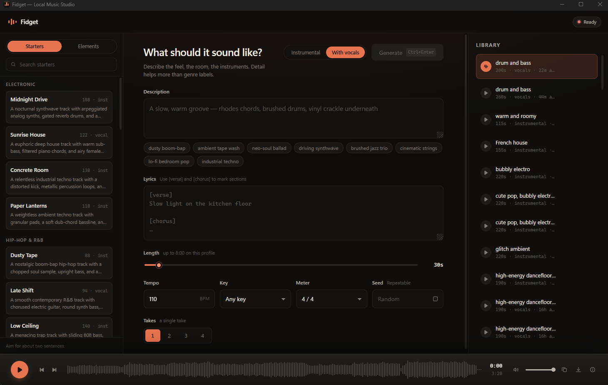

# Fidget

[](LICENSE)
[](#requirements)
[](#why-fidget)
[](#requirements)
[](https://github.com/ace-step/ACE-Step-1.5)

**A music studio that runs entirely on your own machine.**

Describe a piece of music in a sentence or two, and Fidget writes and renders it — a complete track with structure, instrumentation, and optional vocals. Nothing is uploaded, nothing is queued on someone else's server, and there is no subscription. The model runs on your GPU, and the audio it produces is yours.



---

## Why Fidget

Most AI music tools are websites. You type into a box, wait in a queue, and hope the result is close enough — and every track you make lives on infrastructure you don't control.

Fidget is a desktop application built around the opposite idea. It is a small, fast native window that puts a real instrument in front of you: a prompt library to start from, controls that map to how musicians actually describe music, a proper waveform player, and a library of everything you've made. It is designed to be used for an afternoon, not admired for five minutes.

---

## What you can do

**Start from a blank page, or don't.** Fidget ships with a library of complete, ready-to-use prompts across eight genre families — each one carrying its own tempo, key, and length. Click one and the composer fills in. If you'd rather build your own, there is a second library of individual descriptors — genres, instruments, vocal styles, moods, rhythms, production textures — that you can toggle on and off. Everything you type by hand is preserved as you do.

**Write tracks from ten seconds to eight minutes.** Short loops for sketching, full-length pieces when you want them.

**Generate several takes at once.** Ask for up to four variations of the same idea and Fidget renders them one after another, each with its own seed, pacing the queue so your machine is never asked to do two at a time. Picking the best of four is almost always faster than trying to get one perfect.

**Keep what works, discard what doesn't.** Every finished track lands in your library. New ones are quietly highlighted until you've heard them. A thumbs-up keeps a track; a thumbs-down removes it and its audio file from disk.

**Listen properly.** The player draws a real waveform from the rendered audio — not a decorative animation — with click-to-seek, volume, and a details panel showing exactly how the track was made: render time, peak memory, measured length, loudness, seed, and a SHA-256 checksum of the file.

**Reproduce anything.** Every take records the seed that produced it, so a result you liked can always be made again.

---

## Requirements

Fidget is a Windows application and needs a reasonably capable NVIDIA GPU.

| | |
|---|---|
| **Operating system** | Windows 10 or 11 |
| **GPU** | NVIDIA with CUDA support, 8 GB VRAM or more |
| **Memory** | 16 GB system RAM |
| **Software** | Python 3.12, Node.js, Git |

The reference machine for this build is an RTX 3060 Ti (8 GB), an i5-10400F, and 16 GB of RAM. More VRAM means longer tracks and faster rendering; ACE-Step scales its own limits to the card it finds.

Fidget renders inside an embedded Edge WebView2 window, which ships with Windows 11 and current Windows 10 installs. It never opens a browser.

---

## Installation

### Download the app

Grab the latest build from the [releases page](https://github.com/dovvnloading/fidget/releases), unzip it anywhere, and run `Fidget.exe`.

Builds are not yet code-signed, so Windows SmartScreen will warn you the first time — click **More info**, then **Run anyway**. Every release lists a SHA-256 checksum you can verify against:

```powershell
Get-FileHash .\Fidget-1.0.0-windows-x64.zip -Algorithm SHA256
```

The app still needs the ACE-Step model, which is not bundled — it is several gigabytes and belongs in one place on your machine rather than inside every release. Run `.\setup.ps1 -SkipModelDownload:$false` from a source checkout once to fetch it, or follow [Building from source](#building-from-source) below.

### Building from source

From PowerShell, in the project folder:

```powershell
.\setup.ps1
```

This does everything in one pass: creates the Python environment, builds the interface, clones ACE-Step into an isolated runtime of its own, and downloads the model weights. It takes a while on first run — the model download is several gigabytes — and it verifies that CUDA is genuinely working before it finishes.

Then start the app:

```powershell
.\run.ps1
```

If you'd rather fetch the model weights separately, `.\setup.ps1 -SkipModelDownload` sets up everything else.

---

## Using Fidget

### Describing a track

The description is the single most important thing you write. Fidget's own prompt library is built to the shape ACE-Step responds to best — roughly two sentences that name four things:

> *A nostalgic boom-bap hip-hop track with a chopped soul sample, upright bass, and a crisp swung snare. Features vinyl crackle, muted rhodes chords, and warm, lo-fi production.*

**Genre**, **instruments**, **mood**, and **production style**. Being specific beats being poetic — "rock song" leaves everything to chance, while "crunchy rhythm guitar, punchy snare, gravelly male vocals" describes something the model can actually build.

One thing worth knowing: **don't put tempo or key in the description.** They have their own controls, and saying "slow ballad" while the tempo dial reads 160 BPM gives the model contradictory instructions. Set them in the fields provided and let the description handle character.

### Lyrics

Switch to **With vocals** and a lyrics field appears. Square-bracket tags mark the song's structure and shape its energy over time:

```
[Intro]

[Verse 1]
Slow light on the kitchen floor
Everything the way you left it

[Chorus]
We rise together
Into the light

[Bridge]

[Outro]
```

Lines of roughly six to ten syllables sit most naturally. Capital letters raise intensity, and text in (parentheses) becomes backing vocals. Even if you don't have words yet, laying out the tags alone gives the model a useful map of where the song should build and where it should breathe.

### Takes

The **Takes** control asks for up to four variations in one go. They render sequentially, and you can cancel any of them individually while the rest continue.

---

## Under the hood

Fidget keeps three things apart on purpose, and the reason is stability.

The **interface** runs in a native window. A small **controller** serves it and owns the job queue. Each generation then runs in a **separate, disposable worker process** that is launched, watched, and torn down for every single track.

That isolation is what keeps the app usable. Generation is memory-hungry and occasionally fails; when it does, only the worker dies. The window stays responsive, your library stays intact, and the failure is reported rather than taking the application down with it. The supervisor watches memory and a heartbeat throughout, and stops a run that starts to endanger the machine. GPU memory is fully released after every track.

Nothing is trusted blindly, either. Before a finished track appears in your library, its audio is parsed, checked that it isn't silent, and verified against a SHA-256 checksum computed by both the worker and the controller.

---

## Configuration

Fidget works without configuration. These environment variables are there if you need them:

| Variable | Default | What it does |
|---|---|---|
| `FIDGET_MAX_DURATION` | `480` | Longest track, in seconds |
| `FIDGET_MAX_VARIATIONS` | `4` | Takes allowed per request |
| `FIDGET_ENABLE_LM` | `true` | Set `false` to skip the planning model and use less memory |
| `FIDGET_MIN_RAM_GB` | `7.0` | System RAM that must be free before a run starts |
| `FIDGET_MIN_FREE_VRAM_MB` | `7000` | GPU memory that must be free before a run starts |
| `FIDGET_JOB_COOLDOWN_SECONDS` | `6` | Pause between consecutive takes |
| `FIDGET_DATA_ROOT` | `D:\AI\fidget` | Where models, audio, and job state live |

If Fidget refuses to start a run because memory is low, closing a browser is usually enough. If your machine handles it comfortably below the default floor, lowering `FIDGET_MIN_RAM_GB` is reasonable.

---

## Built on ACE-Step

Fidget is an interface. **All of the music is generated by [ACE-Step 1.5](https://github.com/ace-step/ACE-Step-1.5)**, an open-source music generation model, and every credit for the quality of the audio belongs to that project and its authors.

ACE-Step is a genuinely remarkable piece of open research — a foundation model that generates complete songs with coherent structure, vocals in more than fifty languages, and control over tempo, key, and arrangement, all fast enough to run on consumer hardware. Fidget uses the **Turbo** checkpoint together with the **0.6B language model**, a combination chosen to fit comfortably in 8 GB of VRAM.

**Project links**

- Repository — <https://github.com/ace-step/ACE-Step-1.5>
- Model weights — <https://huggingface.co/ACE-Step/Ace-Step1.5>
- Project page — <https://ace-step.github.io/ace-step-v1.5.github.io/>

**Getting the model.** You don't need to download anything by hand; `setup.ps1` clones ACE-Step and fetches exactly the two checkpoints Fidget uses (`acestep-v15-turbo` and `acestep-5Hz-lm-0.6B`) into an isolated environment. Should you want them directly, they are on Hugging Face at the link above.

**Licence.** ACE-Step is released under the MIT Licence. Fidget bundles none of its code or weights — setup fetches them from the official sources at install time.

**Citation.** If ACE-Step is useful in your own work, the authors ask that you cite it:

```bibtex
@misc{gong2026acestep,
    title={ACE-Step 1.5: Pushing the Boundaries of Open-Source Music Generation},
    author={Junmin Gong, Yulin Song, Wenxiao Zhao, Sen Wang, Shengyuan Xu, Jing Guo},
    howpublished={\url{https://github.com/ace-step/ACE-Step-1.5}},
    year={2026},
    note={GitHub repository}
}
```

---

## Development

```powershell
# Test suite
.\.venv\Scripts\python.exe -m pytest -q

# Rebuild the interface
npm --prefix .\frontend run build

# Interface with hot reload, against a running controller
npm --prefix .\frontend run dev
```

The layout is straightforward: `fidget/backend` holds the controller and the worker supervisor, `fidget/worker` is the isolated generation process, and `frontend/src` is the React interface.

---

## Licence

Fidget is released under the MIT Licence. See [LICENSE](LICENSE).

Music you generate with Fidget is yours. Bear in mind that ACE-Step's own model licence governs the weights themselves — worth a read if you intend to publish commercially.
